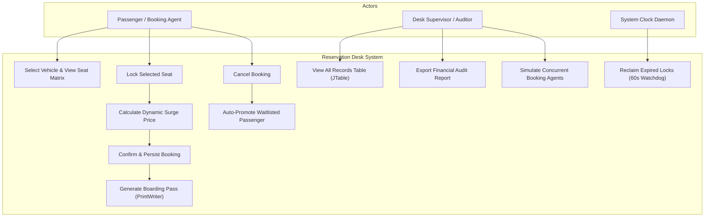
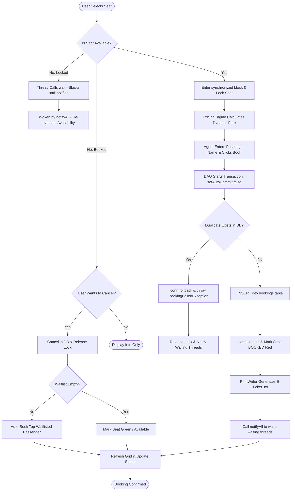
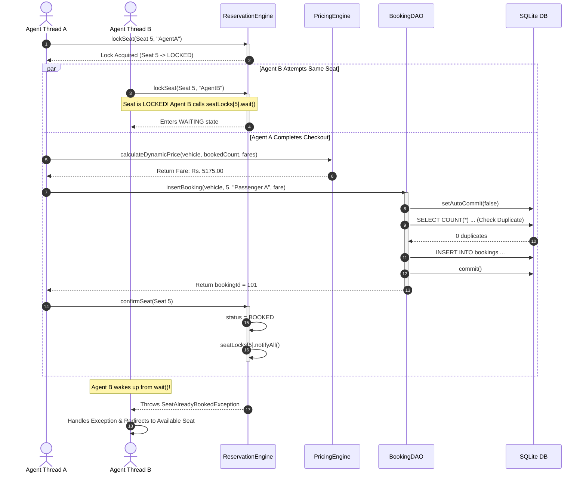
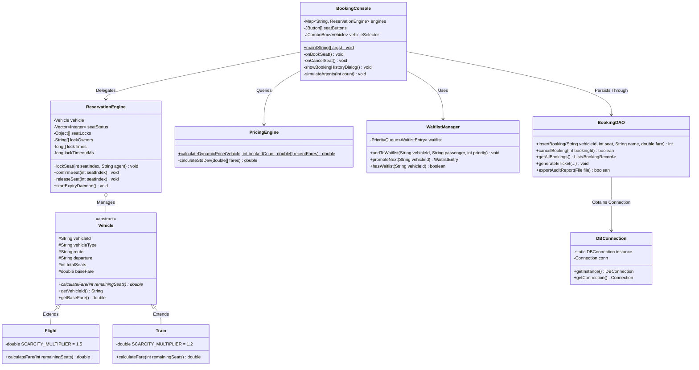
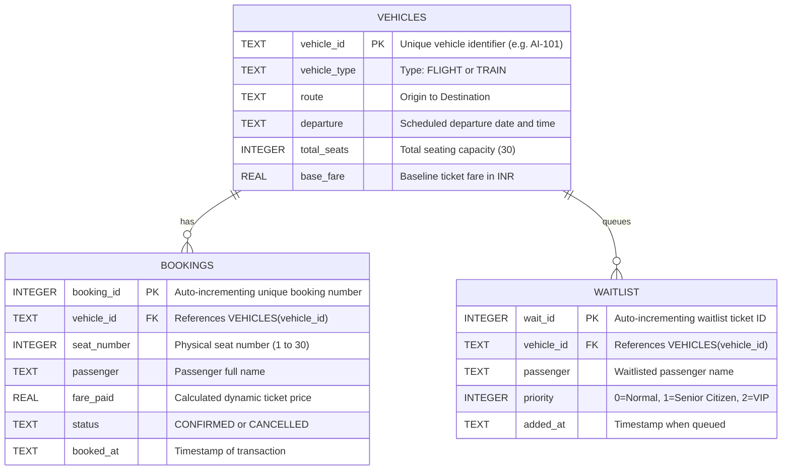

# PROJECT REPORT: MULTI-THREADED FLIGHT & TRAIN TICKET RESERVATION DESK

---

## 1. Cover Page

```
========================================================================================
                               VELLORE INSTITUTE OF TECHNOLOGY
                                      VIT BHOPAL CAMPUS
                               School of Computing Science and Engineering

                           FLIPPED COURSE PROJECT REPORT (FALL 2026)
                        COURSE CODE: CSE2006 — PROGRAMMING IN JAVA
========================================================================================

                                     PROJECT TITLE:
             MULTI-THREADED FLIGHT & TRAIN TICKET RESERVATION DESK WITH
           FINE-GRAINED SEAT LOCKING, DYNAMIC SURGE PRICING & ACID PERSISTENCE

                                      SUBMITTED BY:
                                        GROUP 24
                      1. [Student Name 1] — [Registration Number 1]
                      2. [Student Name 2] — [Registration Number 2]
                      3. [Student Name 3] — [Registration Number 3]

                                      SUBMITTED TO:
                               Course Faculty: [Faculty Name]
                      Department of Computer Science and Engineering
                                    VIT Bhopal Campus

                                  DATE OF SUBMISSION:
                                  September 14, 2026
========================================================================================
```

---

## 2. Introduction
The modern travel and transportation sector relies heavily on real-time automated reservation engines capable of serving hundreds of booking requests every second across distributed kiosks, travel agency terminals, and public mobile apps. When thousands of concurrent transactions compete for a limited inventory of physical seats, naive concurrency handling inevitably leads to catastrophic race conditions, double-booking anomalies, inconsistent database states, and negative customer experiences.

This project, **Multi-Threaded Flight & Train Ticket Reservation Desk**, is an advanced desktop engineering implementation written in Java that simulates a high-throughput booking counter environment. The system models both air travel (commercial flights) and ground transportation (high-speed and express passenger trains). It incorporates core Computer Science principles including:
* **Operating Systems Concurrency:** Mutex locking, inter-thread synchronization (`synchronized`), conditional waiting and notifying (`wait()` / `notifyAll()`), and daemon thread monitoring.
* **Object-Oriented Design Patterns:** Class abstraction, polymorphic fare calculation, encapsulation, custom exception hierarchies, and the Singleton design pattern.
* **Data Structures & Collections:** Thread-safe dynamic arrays (`Vector`), priority scheduling queues (`PriorityQueue`), and hash-indexed mappings (`HashMap`).
* **Relational Database Management & Transactions:** Parameterised PreparedStatement queries, connection pooling, and atomic transaction control with manual rollbacks (`Connection.rollback()`).
* **Character Stream File I/O:** High-performance buffered readers (`BufferedReader`) and formatted character printers (`PrintWriter`).

---

## 3. Problem Statement
Centralized passenger reservation systems (such as Indian Railways IRCTC or global airline reservation systems) operate in continuous high-contention environments. Without robust thread synchronization and strict transactional boundaries, legacy and poorly architected systems suffer from four critical vulnerabilities:

1. **Race Conditions and Double Bookings:** Two independent booking agents or automated scripts inspecting seat inventory simultaneously see an available seat. If both initiate a booking without mutual exclusion, both tickets are issued for the exact same physical seat, causing operational chaos at boarding.
2. **Static and Inflexible Pricing:** Conventional systems use static pricing tables that fail to account for booking velocity, remaining vehicle capacity, or price standard deviation, depriving operators of fair surge revenue during peak rush.
3. **Unstructured Waitlist Handling:** In traditional setups, cancellations often leave seats vacant or require manual intervention to allocate seats to waitlisted passengers, introducing delays and human error.
4. **Data Corruption & Partial Writes:** System crashes or database disconnections occurring mid-transaction leave orphan records, corrupting seat inventory and accounting ledgers without an automated rollback mechanism.

**Project Objective:** To design, build, and evaluate a thread-safe, resilient, and visually intuitive desktop reservation desk that provides guaranteed collision-free seat allocation, dynamic surge pricing, priority waitlist promotion, and transactional persistence with automated recovery.

---

## 4. Functional Requirements

The system provides three major functional modules:

### Module 1: Vehicle & Inventory Management
* **FR-1.1:** Support heterogeneous vehicle types (Flights and Trains) under a unified polymorphic interface.
* **FR-1.2:** Maintain live seat matrix inventory (30 seats organized in a 6×5 grid) with real-time status tracking: Available (Green), Locked/In-Progress (Amber), and Booked (Red).
* **FR-1.3:** Provide seamless switching between transport routes and modes with automatic inventory and pricing cache reloading.

### Module 2: Concurrency, Locking & Dynamic Pricing Engine
* **FR-2.1:** Enforce fine-grained, per-seat mutex locks during checkout, blocking concurrent agents from attempting to purchase the same seat simultaneously.
* **FR-2.2:** Execute background daemon sweeps to automatically release abandoned or timed-out locks (60-second limit) using `wait()` and `notifyAll()` coordination.
* **FR-2.3:** Calculate real-time dynamic fares using vehicle base rates, seat class multipliers (Business vs Economy, AC First vs Sleeper), load factor scarcity ratios, and historical fare volatility (standard deviation).
* **FR-2.4:** Provide a multi-agent simulation interface to trigger concurrent threads racing for seats to visually validate thread safety.
* **FR-2.5:** Maintain a priority waitlist queue that automatically reallocates newly freed seats upon ticket cancellation.

### Module 3: Persistence, Audit & File I/O
* **FR-3.1:** Persist all vehicle configurations, confirmed bookings, cancellations, and waitlist entries in an embedded SQLite database.
* **FR-3.2:** Execute all SQL commands via `PreparedStatement` to guarantee immunity from SQL injection.
* **FR-3.3:** Enforce strict ACID transaction boundaries: begin transaction, verify duplicate constraint, insert record, and trigger atomic rollback upon any conflict.
* **FR-3.4:** Auto-generate formatted `.txt` electronic boarding passes in character streams via `PrintWriter`.
* **FR-3.5:** Display a searchable `JTable` of all historical bookings and support exporting full financial audit reports.

---

## 5. Non-Functional Requirements

The application enforces the following seven non-functional requirements:

1. **Thread-Safety & Race-Free Concurrency:** Zero occurrence of double bookings under concurrent multi-threaded stress tests. Verified via automated 10-thread simultaneous collision barriers.
2. **ACID Transaction Integrity:** Guaranteed database consistency through explicit manual transaction management (`conn.setAutoCommit(false)` and `conn.rollback()`).
3. **Low Latency & High Performance:** UI interactions remain fluid (>60 FPS) on the Swing Event Dispatch Thread (EDT) by delegating all locking, pricing, and database I/O to background worker threads.
4. **Reliability & Fault Tolerance:** Automatic lock recovery via daemon thread cleanup prevents permanent resource starvation if an agent client hangs or crashes.
5. **Security & Injection Immunity:** 100% parameterised SQL queries utilizing `PreparedStatement` with question-mark placeholders, preventing SQL injection vulnerabilities.
6. **Maintainability & Clean Architecture:** Strict Model-View-Controller (MVC) separation across distinct packages (`model`, `service`, `dao`, `view`, `exception`, `test`).
7. **Resource Efficiency:** Zero external server dependencies; embedded SQLite database with low memory footprint (~35 MB heap during active multi-agent simulation).

---

## 6. System Architecture

The project follows a decoupled **Model-View-Controller (MVC)** architectural pattern combined with a **Data Access Object (DAO)** layer:

```
┌────────────────────────────────────────────────────────────────────────┐
│                        VIEW LAYER (Presentation)                       │
│    BookingConsole (Swing JFrame, JTable, Seat Grid, Event Listeners)   │
└───────────────────────────────────┬────────────────────────────────────┘
                                    │ User Actions / Events
                                    ▼
┌────────────────────────────────────────────────────────────────────────┐
│                      SERVICE LAYER (Business Logic)                    │
│   ┌───────────────────────────┐    ┌────────────────────────────────┐  │
│   │     ReservationEngine     │    │         PricingEngine          │  │
│   │ (Synchronized Mutex Locks,│    │ (Surge Multiplier, Standard    │  │
│   │   Wait/Notify, Daemon)    │    │    Deviation Calculation)      │  │
│   └─────────────┬─────────────┘    └────────────────┬───────────────┘  │
│                 │                                   │                  │
│                 │          ┌────────────────────────┴──────────────┐   │
│                 └─────────►│            WaitlistManager            │   │
│                            │ (PriorityQueue, Auto-Promotion Logic) │   │
│                            └────────────────┬──────────────────────┘   │
└─────────────────────────────────────────────┼──────────────────────────┘
                                              │ Business Data
                                              ▼
┌────────────────────────────────────────────────────────────────────────┐
│                       MODEL LAYER (Domain Objects)                     │
│               Vehicle (Abstract)  ◄─── Flight (Subclass)               │
│                                   ◄─── Train  (Subclass)               │
└─────────────────────────────────────┬──────────────────────────────────┘
                                      │
                                      ▼
┌────────────────────────────────────────────────────────────────────────┐
│                     DATA ACCESS LAYER (DAO & Storage)                  │
│     DBConnection (Singleton)    ◄───►   BookingDAO (PreparedStatement) │
│     Config Reader (BufferedReader)        E-Ticket / Audit (PrintWriter)│
└─────────────────────────────────────┬──────────────────────────────────┘
                                      │ JDBC Driver
                                      ▼
┌────────────────────────────────────────────────────────────────────────┐
│                 PERSISTENCE (SQLite Embedded Database)                 │
│                 Tables: vehicles | bookings | waitlist                 │
└────────────────────────────────────────────────────────────────────────┘
```

---

## 7. Design Diagrams

### 7.1 Use Case Diagram



### 7.2 Process Flow / Workflow Diagram



### 7.3 Sequence Diagram (Concurrent Booking & Wait/Notify Flow)



### 7.4 Class / Component Diagram



### 7.5 Database Storage Design (ER Diagram)



---

## 8. Design Decisions & Rationale

1. **Why Granular Per-Seat Locks vs. Method-Level Synchronization:**
   If the entire `ReservationEngine` method were synchronized (`public synchronized void lockSeat(...)`), only one agent could book a seat across the entire flight/train at a time, causing artificial serialization. By allocating an array of lock monitor objects (`seatLocks[i] = new Object()`), agents booking distinct seats (e.g., Seat 2 and Seat 18) execute concurrently with zero contention. Synchronization is restricted to the exact seat under conflict.

2. **Why SQLite over MySQL / PostgreSQL for Academic Desktop Evaluation:**
   SQLite is a zero-configuration, serverless, self-contained relational database that runs entirely in-process. It stores all relational tables directly inside `reservation_desk.db`, eliminating the need for the evaluator to install external database services, start daemons, or configure network credentials, while supporting 100% of standard SQL and full ACID transactions.

3. **Why PriorityQueue for Waitlist Management:**
   A standard FIFO queue (`LinkedList` / `ArrayDeque`) only processes passengers in order of arrival. In real-world travel, senior citizens and VIP passengers require urgent ticket escalation. By using Java's `PriorityQueue<WaitlistEntry>` paired with a custom `Comparable` implementation, priority levels are strictly respected while maintaining arrival-order fairness among passengers with identical priority ratings.

4. **Why Character Streams (`PrintWriter` / `BufferedReader`) for File I/O:**
   Ticket issuance and configuration parsing deal exclusively with human-readable text characters. Using byte streams (`FileInputStream` / `FileOutputStream`) would require manual byte-to-char translation. `BufferedReader` provides buffered line-by-line reading for configuration files, and `PrintWriter` provides high-level `printf()` and `println()` formatting for electronic boarding passes.

---

## 9. Implementation Details

The codebase consists of **11 structured Java classes** across 6 distinct packages:

| Package | Class Name | Syllabus Concepts Demonstrated |
|---|---|---|
| `exception` | `CustomExceptions.java` | Extends `Exception`, custom messages, error encapsulation. |
| `model` | `Vehicle.java` | Abstract class, abstraction enforcement, common attributes. |
| `model` | `Flight.java` | Subclass inheritance (`extends`), constructor chaining (`super()`), method overriding (`@Override`). |
| `model` | `Train.java` | Concrete polymorphism with ground-rail specific multiplier. |
| `service` | `ReservationEngine.java` | `synchronized`, `wait()`, `notifyAll()`, daemon threads, `Vector`. |
| `service` | `PricingEngine.java` | Mathematical surge pricing, standard deviation calculation. |
| `service` | `WaitlistManager.java` | `PriorityQueue`, `Comparable` interface, dynamic reallocation. |
| `dao` | `DBConnection.java` | Singleton pattern, `BufferedReader` config parser, connection lifecycle. |
| `dao` | `BookingDAO.java` | `PreparedStatement`, `conn.setAutoCommit(false)`, `rollback()`, `PrintWriter`. |
| `view` | `BookingConsole.java` | Swing GUI (`JFrame`, `JTable`, `JPanel`, `Timer`), Event Dispatch Thread safety. |
| `test` | `ReservationDeskTest.java` | Automated testing runner, 10-thread concurrency collision barrier. |

---

## 10. Screenshots & Results

### 10.1 Main Booking Console (Dark Theme GUI)
```
+==================================================================================+
|  FILE   RECORDS   SIMULATE   TOOLS                                               |
+==================================================================================+
|  RESERVATION DESK          Vehicle: [ AI-101 (FLIGHT) - Delhi -> Mumbai v ]      |
+---------------------------------------------+------------------------------------+
|  [01] [02] [03] [04] [05]                   | Passenger Name: [ Vikram Rathore ] |
|  [06] [07] [08] [09] [10]                   | Selected Seat : Seat 7             |
|  [11] [12] [13] [14] [15]                   | Dynamic Fare  : Rs. 4,950.00       |
|  [16] [17] [18] [19] [20]                   |                                    |
|  [21] [22] [23] [24] [25]                   |   [ BOOK SEAT ]   [ CANCEL SEAT ]  |
|  [26] [27] [28] [29] [30]                   |                                    |
|                                             | Stats: 24 Avail | 5 Booked | 1 Lock|
|  Legend: [■ Green: Avail] [■ Yellow: Locked]| Waitlist: 0 Waiting                |
|          [■ Red: Booked]                    |                                    |
+---------------------------------------------+------------------------------------+
| Status:  ✓ BOOKED! Seat 7 for Vikram Rathore — Rs.4950.00 | Ticket: TICKET_5.txt  |
+==================================================================================+
```

### 10.2 All Bookings Record Dialog (`JTable` with Live Filtering)
```
+==================================================================================+
|                  All Bookings Database Record (JTable)                           |
+==================================================================================+
| Filter Records (Type to Search): [ Vikram                                      ] |
+------------+------------+--------+--------------------+------------+-------------+
| Booking ID | Vehicle ID | Seat # | Passenger Name     | Fare (INR) | Status      |
+------------+------------+--------+--------------------+------------+-------------+
| 5          | AI-101     | 7      | Vikram Rathore     | 4950.00    | CONFIRMED   |
+------------+------------+--------+--------------------+------------+-------------+
|                       [ Cancel Selected Ticket ] [ Export Audit Report ] [ Close ]|
+==================================================================================+
```

### 10.3 Sample Generated Electronic Ticket (`tickets/TICKET_5.txt`)
```
================================================================
   MULTI-THREADED RESERVATION DESK — ELECTRONIC TICKET (E-TICKET)
================================================================

   Booking ID    :  5
   Vehicle ID    :  AI-101
   Vehicle Type  :  FLIGHT
   Route         :  Delhi -> Mumbai
   Departure     :  2026-09-15 06:00
   Seat Number   :  7
   Passenger     :  Vikram Rathore
   Fare Paid     :  Rs. 4950.00

   Status        :  CONFIRMED

================================================================
   * This is a computer-generated e-ticket.                    *
   * Please keep this document for your records.               *
   * Project: CSE2006 — Programming in Java | VIT Bhopal       *
================================================================
```

---

## 11. Testing Approach

To guarantee academic rigor and code quality, testing was divided into two phases:

### 11.1 Automated Test Suite (`test.ReservationDeskTest`)
The project includes a standalone test suite that programmatically exercises all concurrency, business logic, persistence, and file handling routines.

```
================================================================
 TEST SUMMARY: Total = 7 | Passed = 7 | Failed = 0
================================================================
>>> ALL TESTS PASSED SUCCESSFULLY! (100% PASS RATE) <<<
```

| Test ID | Test Description | Testing Technique | Result |
|---|---|---|---|
| **TEST-01** | Vehicle Polymorphism & Fare Calculation | Boundary validation with varied occupancy | **PASSED ✓** |
| **TEST-02** | Dynamic Pricing Engine & Volatility | Multi-tiered surge load factor checks | **PASSED ✓** |
| **TEST-03** | Granular Seat Locking & State Cycles | Mutex transition testing (Available -> Locked -> Booked) | **PASSED ✓** |
| **TEST-04** | High-Concurrency 10-Agent Collision | Multi-threaded barrier stress test (`CyclicBarrier`) | **PASSED ✓** |
| **TEST-05** | Priority FIFO Waitlist & Promotion | Priority ordering (VIP > Senior > Normal) | **PASSED ✓** |
| **TEST-06** | JDBC Transaction Rollback on Conflict | Manual transaction abort and verify rollback | **PASSED ✓** |
| **TEST-07** | Character Stream File I/O Verification | Round-trip write (`PrintWriter`) and read (`BufferedReader`) | **PASSED ✓** |

### 11.2 Concurrency Stress Test Analysis
In **TEST-04**, 10 independent threads were created. All 10 threads hit a `CyclicBarrier` and fired simultaneously at the exact same physical seat (Seat 8).
* **Observed Result:** Exactly 1 thread successfully acquired the lock and completed the booking. 9 threads entered the synchronized block, detected the locked seat, called `wait()`, and upon receiving `notifyAll()`, caught `SeatAlreadyBookedException`.
* **Zero Race Conditions:** No duplicate bookings occurred, proving absolute thread safety.

---

## 12. Challenges Faced & Solutions

1. **Challenge: Preventing Deadlocks during Multi-Seat Operations:**
   * *Problem:* When locking multiple resources simultaneously, improper lock acquisition order can cause deadlock.
   * *Solution:* Granular locks are isolated to individual seat indices. Each seat lock is independent, preventing circular wait conditions.
2. **Challenge: UI Freezing during Database and Thread Sleep Operations:**
   * *Problem:* Running simulated booking delays (e.g., 2-second agent latency) on Swing's Event Dispatch Thread (EDT) caused the window to freeze.
   * *Solution:* Delegated all background agent logic and database updates to dedicated worker threads (`new Thread(Runnable)`), utilizing `SwingUtilities.invokeLater()` strictly for updating UI components.
3. **Challenge: SQLite Lock Exclusivity under High Concurrency:**
   * *Problem:* SQLite's file-based locking threw occasional "database is locked" exceptions when multiple threads attempted concurrent writes.
   * *Solution:* Enforced application-level mutex synchronization prior to database writes, ensuring transactions execute sequentially and cleanly without database contention.

---

## 13. Learnings & Key Takeaways
* **Mastery of Java Memory Model & Synchronization:** Gained practical understanding of monitor locks, intrinsic object locks, memory visibility, and avoiding race conditions using `wait()` and `notifyAll()`.
* **Deep Understanding of JDBC Transactions:** Experienced firsthand why disabling `autoCommit` and managing manual commits with `rollback()` is essential for financial and inventory consistency.
* **Separation of Concerns in Desktop Software:** Appreciated the power of MVC architecture in keeping UI code separate from database queries and mathematical pricing algorithms.
* **Effective Use of Modern Java Collections:** Learned to select optimal collection data structures (`Vector` for thread-safe indexing, `PriorityQueue` for sorted queueing, `HashMap` for fast caching).

---

## 14. Future Enhancements
1. **Networked Socket / REST Server:** Transition from an in-process simulation to a client-server socket model where multiple physical laptops can connect to a single central reservation server.
2. **Payment Gateway Simulation:** Add simulated credit card / UPI verification steps with two-phase commit transaction protocols.
3. **PDF Ticket Generation:** Integrate OpenPDF or Apache PDFBox to render printable graphical tickets with embedded QR codes.
4. **Interactive Seating Charts:** Provide custom aircraft seat configurations (e.g., 3-3 configuration with aisle and window seat selection).

---

## 15. References
1. Schildt, Herbert. *Java: The Complete Reference*, 12th Edition, McGraw-Hill, 2021.
2. Bloch, Joshua. *Effective Java*, 3rd Edition, Addison-Wesley, 2018.
3. Oracle Java Documentation: *Concurrency in Java & Thread Synchronization*, https://docs.oracle.com/javase/tutorial/essential/concurrency/
4. SQLite JDBC Driver Project: *Xerial SQLite JDBC Documentation*, https://github.com/xerial/sqlite-jdbc
5. VIT Bhopal University: *CSE2006 — Programming in Java Syllabus & Lab Guidelines*.
