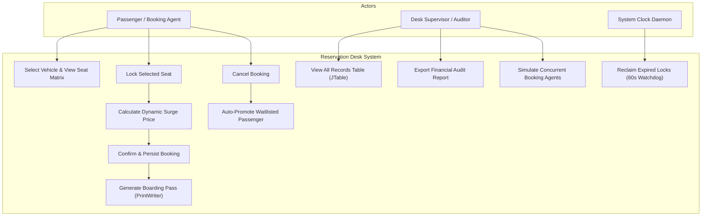
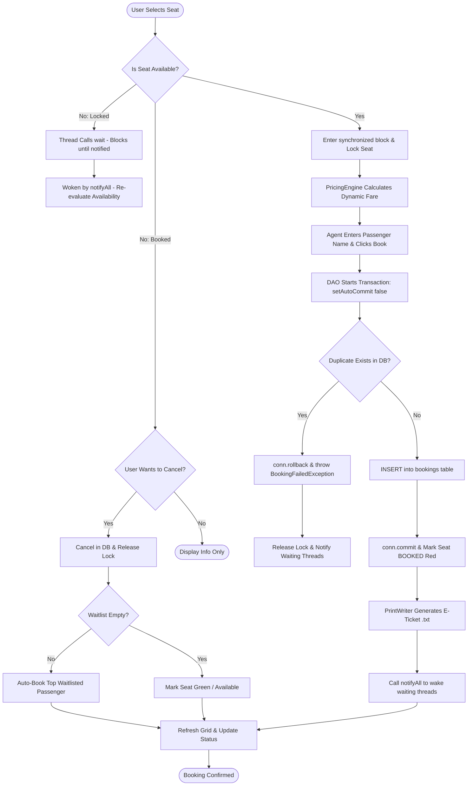
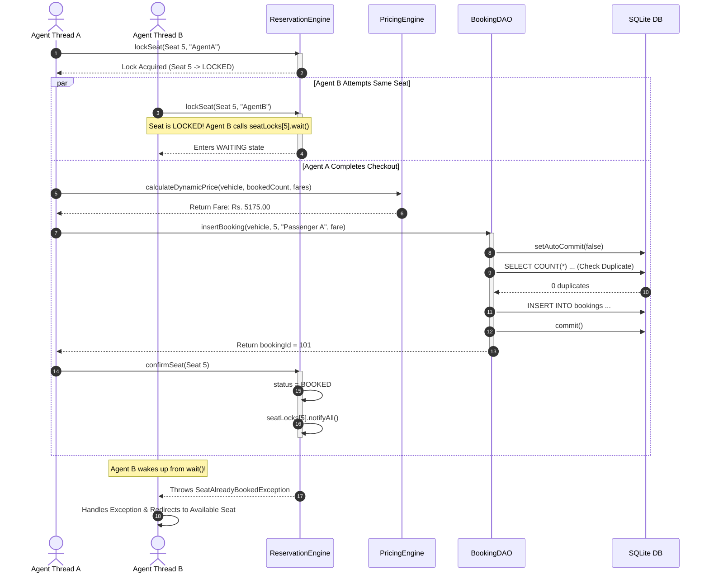
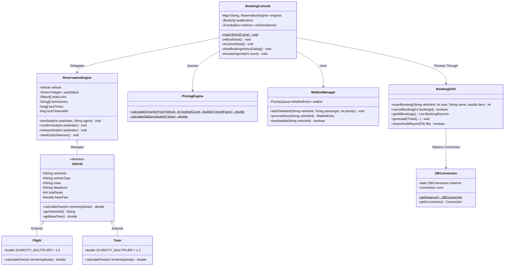
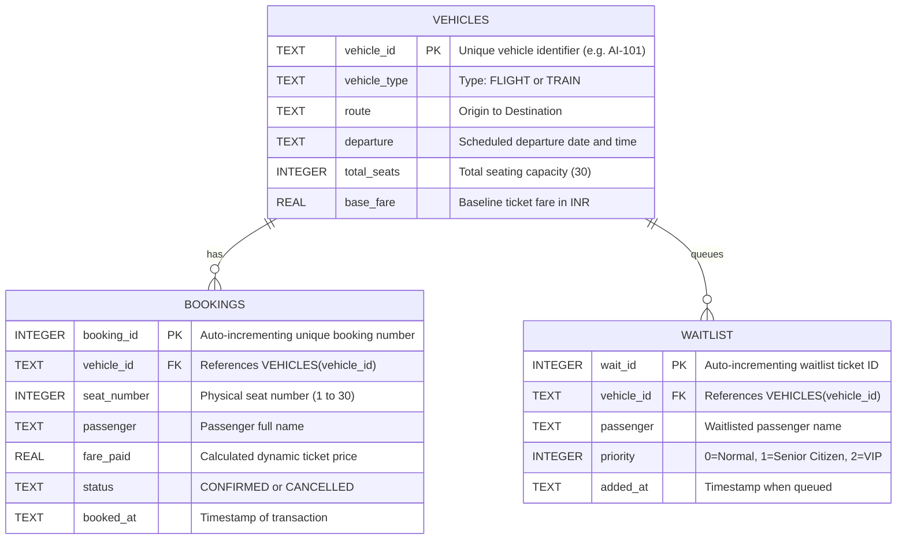

# Design Diagrams

## 1. Use Case Diagram

---

## 2. Process Flow / Workflow Diagram

---

## 3. Sequence Diagram (Concurrent Booking & Wait/Notify Flow)

---

## 4. Class / Component Diagram

---

## 5. Database Storage Design (ER Diagram)

